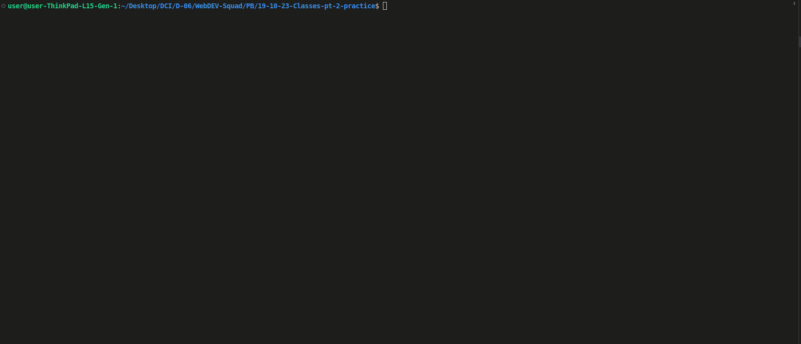

**Übung**: Erstelle ein einfaches Quiz-Spiel

### Aufgabe 1: Erstelle eine Klasse namens `Frage`, um eine Quiz-Frage zu repräsentieren. Die Klasse sollte folgende Merkmale haben:

- Einen Konstruktor, der den Fragetext und ein Array von Antwortmöglichkeiten akzeptiert.
- Eine Methode, um die Frage und die Antwortmöglichkeiten anzuzeigen.
- Eine Methode, um zu überprüfen, ob die Antwort des Benutzers richtig ist.

### Aufgabe 2: Erstelle Instanzen der `Frage`-Klasse für mindestens drei verschiedene Quiz-Fragen. Sei kreativ bei den Fragen und Antwortmöglichkeiten.

### Aufgabe 3: Implementiere eine Möglichkeit für den Benutzer, die Fragen zu beantworten. Du kannst das `readline`-Modul verwenden, um Eingaben im Terminal zu erfassen. Alternativ kannst du HTML mit DOM-Manipulation verwenden, was eine neue Herausforderung für dich ist.

### Aufgabe 4: Nachdem der Benutzer alle Fragen beantwortet hat, zeige ihm die Ergebnisse an. Zeige, wie viele Fragen er richtig und wie viele er falsch beantwortet hat.

## Bonusaufgabe 1

Füge ein Punktesystem zu deinem Quiz-Spiel hinzu. Weisen jeder Frage eine bestimmte Punktzahl zu und halte die Gesamtpunktzahl des Benutzers fest. Zeige am Ende die endgültige Punktzahl des Benutzers an.

## Bonusaufgabe 2

Füge einen Timer zu deinem Quiz-Spiel hinzu. Gib dem Benutzer eine begrenzte Zeit, um alle Fragen zu beantworten. Falls er nicht rechtzeitig antwortet, zählen die nicht beantworteten Fragen als falsch.

**_Sei kreativ und gestalte das Quiz-Spiel nach deinen Vorstellungen. Viel Spaß beim Programmieren und Lernen!_**
